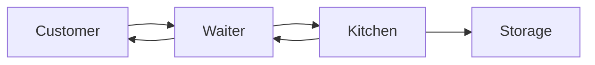
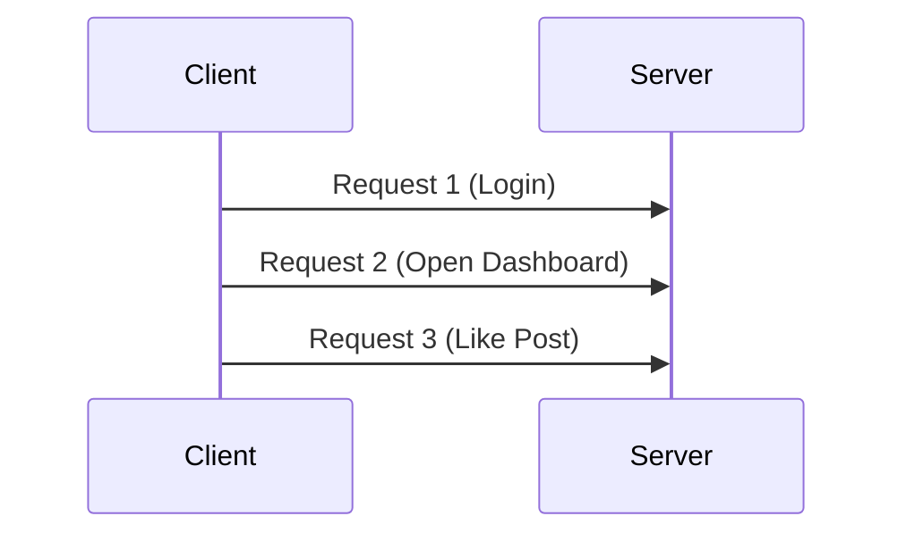
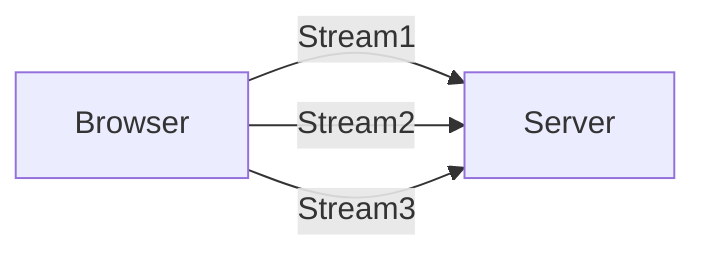
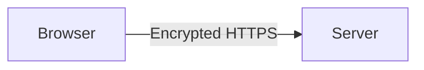
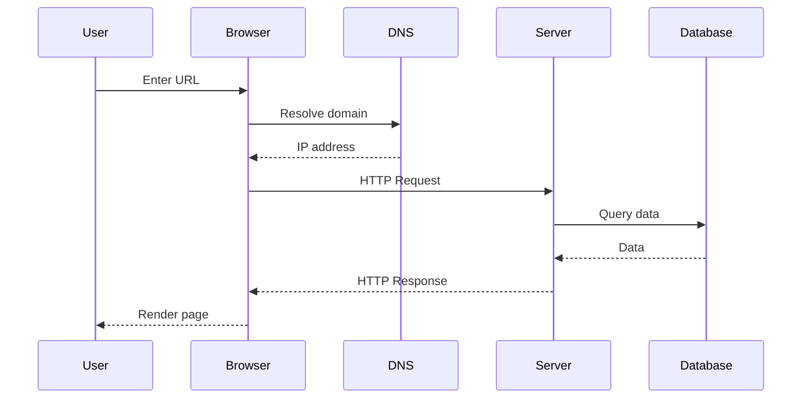

# What is HTTP?

Every time you open a website, watch a YouTube video, or log into an app, a conversation happens between your device and a remote server.

This conversation happens using a protocol called **HTTP**.

> **HTTP (HyperText Transfer Protocol)** is the communication protocol that allows web browsers and backend servers to talk to each other.

It is essentially the **language of the web**.

Without HTTP, the internet as we know it would not exist.

Every action like:

- loading a webpage
- submitting a form
- fetching data
- uploading files
- logging in

is performed through **HTTP requests and responses**.

---

# The Big Picture

At a high level, HTTP communication looks like this:

```mermaid
sequenceDiagram
User->>Browser: Enter URL
Browser->>Server: HTTP Request
Server->>Database: Fetch Data
Database-->>Server: Data
Server-->>Browser: HTTP Response
Browser-->>User: Render Page
````

The browser **asks for something**.

The server **responds with data**.

---

# The Two Pillars of HTTP

HTTP is built on two fundamental concepts:

1. **Client-Server Architecture**
2. **Stateless Communication**

Understanding these two ideas explains almost everything about HTTP.

---

# 1. Client–Server Model

HTTP works using a **client-server architecture**.

| Component | Role                                     |
| --------- | ---------------------------------------- |
| Client    | Sends requests                           |
| Server    | Processes requests and returns responses |

---

## What is a Client?

The **client** is the system that initiates communication.

Examples:

* Web browsers
* Mobile apps
* CLI tools
* IoT devices

Typical clients:

* Chrome
* Firefox
* Safari
* Mobile applications
* Postman / curl

Example request from a browser:

```
GET https://example.com/posts
```

The client is basically saying:

> “Please give me this resource.”

---

## What is a Server?

A **server** is a computer that waits for requests and sends responses.

It typically hosts:

* APIs
* websites
* application logic
* databases

Servers process the request and return a response.

Example:

```
HTTP/1.1 200 OK
Content-Type: application/json
```

Followed by data.

---

# Real World Analogy

HTTP works similar to a **restaurant system**.

| Web Concept | Restaurant Analogy  |
| ----------- | ------------------- |
| Client      | Customer            |
| Server      | Kitchen             |
| Request     | Food Order          |
| Response    | Meal                |
| Database    | Ingredients Storage |



The customer never interacts directly with the kitchen.

The waiter acts as the **communication layer**.

Similarly, browsers communicate with servers through HTTP.

---

# The Principle of Statelessness

One of the most important properties of HTTP is:

> **HTTP is stateless.**

Stateless means:

The server **does not remember previous requests**.

Each request is treated independently.

---

## Example

Suppose you perform these actions:

1. Login
2. Open dashboard
3. Like a post

Each of these actions is a **separate HTTP request**.



The server **does not remember earlier requests automatically**.

Every request must contain all required information.

---

## Benefits of Stateless Design

Stateless systems are easier to scale.

| Benefit              | Explanation                              |
| -------------------- | ---------------------------------------- |
| Simpler architecture | Server doesn't track session memory      |
| Better scalability   | Requests can be handled by any server    |
| Higher reliability   | If one server fails, others can continue |

---

## How Modern Apps Maintain State

Even though HTTP is stateless, applications simulate **stateful behavior** using:

| Technique     | Purpose                     |
| ------------- | --------------------------- |
| Cookies       | Store small data in browser |
| Sessions      | Server stored user session  |
| JWT Tokens    | Stateless authentication    |
| Local Storage | Browser storage             |

Example:

```
Authorization: Bearer <JWT_TOKEN>
```

This token tells the server who the user is.

---

# Anatomy of an HTTP Conversation

Every HTTP interaction consists of two parts:

1. **Request**
2. **Response**

---

# HTTP Request

An HTTP request is sent by the client.

Structure:

```
METHOD /path HTTP/version
Headers

Body
```

Example request:

```
POST /users HTTP/1.1
Host: example.com
Content-Type: application/json

{
 "name": "Alice"
}
```

---

## Components of an HTTP Request

| Component | Description       |
| --------- | ----------------- |
| Method    | Action to perform |
| URL       | Resource location |
| Headers   | Metadata          |
| Body      | Optional data     |

---

### Example in Code

```ts
const user = await client.post<User>('/users', {
  name: 'Alice',
  email: 'alice@example.com'
});
```

This sends a **POST request**.

---

# HTTP Response

The server sends a response after processing a request.

Structure:

```
HTTP/version status_code
Headers

Body
```

Example:

```
HTTP/1.1 200 OK
Content-Type: application/json

{
 "id": "123",
 "name": "Alice"
}
```

---

## Components of an HTTP Response

| Component   | Description             |
| ----------- | ----------------------- |
| Status Code | Result of request       |
| Headers     | Metadata about response |
| Body        | Actual data returned    |

---

# Evolution of HTTP

HTTP has evolved significantly.

| Version  | Major Feature                  |
| -------- | ------------------------------ |
| HTTP/1.0 | New TCP connection per request |
| HTTP/1.1 | Persistent connections         |
| HTTP/2   | Multiplexing                   |
| HTTP/3   | QUIC over UDP                  |

---

# HTTP/1.0

Problems:

* One TCP connection per request
* Slow performance
* High latency

```
Request → Connect → Response → Close
```

---

# HTTP/1.1

Improvements:

* Persistent connections
* Keep-alive

Multiple requests reuse the same connection.

---

# HTTP/2

Introduced **multiplexing**.

Multiple requests run simultaneously.



But still suffered from **Head-of-Line Blocking**.

If one packet is lost, everything waits.

---

# HTTP/3 and QUIC

HTTP/3 uses a new protocol called **QUIC**.

QUIC runs on **UDP instead of TCP**.

---

## Why UDP?

TCP guarantees reliability but introduces latency.

UDP is faster but unreliable.

QUIC combines:

* UDP speed
* TCP reliability

Advantages:

| Benefit                 | Description              |
| ----------------------- | ------------------------ |
| Faster connection setup | No TCP handshake         |
| Reduced latency         | Faster data delivery     |
| Packet independence     | No head-of-line blocking |

---

# HTTP Headers

Headers contain metadata about requests and responses.

They function like **labels on packages**.

Example:

```
Content-Type: application/json
```

---

# Categories of Headers

| Category               | Purpose                     |
| ---------------------- | --------------------------- |
| Request Headers        | Information about client    |
| Response Headers       | Server metadata             |
| Representation Headers | Describe body format        |
| Security Headers       | Protect browser environment |

---

## Common Request Headers

| Header        | Description           |
| ------------- | --------------------- |
| User-Agent    | Client browser info   |
| Accept        | Data formats accepted |
| Authorization | Authentication token  |
| Cookie        | Stored browser data   |

Example:

```
User-Agent: Chrome/120
Accept: application/json
```

---

## Representation Headers

Describe body content.

| Header           | Meaning          |
| ---------------- | ---------------- |
| Content-Type     | Type of data     |
| Content-Length   | Size of body     |
| Content-Encoding | Compression type |

Example:

```
Content-Type: application/json
```

---

## Security Headers

Security headers protect users.

| Header                    | Protection           |
| ------------------------- | -------------------- |
| Content-Security-Policy   | Prevent XSS          |
| X-Frame-Options           | Prevent clickjacking |
| Strict-Transport-Security | Force HTTPS          |

---

# HTTP Methods

HTTP methods define the **intent** of the request.

They act like verbs.

| Method | Purpose                 | Idempotent |
| ------ | ----------------------- | ---------- |
| GET    | Retrieve data           | Yes        |
| POST   | Create resource         | No         |
| PUT    | Replace resource        | Yes        |
| PATCH  | Update partial resource | No         |
| DELETE | Remove resource         | Yes        |

---

## What is Idempotency?

An operation is **idempotent** if repeating it produces the same result.

Example:

```
DELETE /users/10
```

Deleting once or ten times results in the same state.

---

# HTTP Status Codes

Status codes tell the client the result of the request.

Structure:

```
XYZ
```

X determines category.

---

# 2xx Success Codes

| Code | Meaning    |
| ---- | ---------- |
| 200  | OK         |
| 201  | Created    |
| 204  | No Content |

Example:

```
HTTP/1.1 201 Created
```

---

# 3xx Redirection

| Code | Meaning              |
| ---- | -------------------- |
| 301  | Permanent redirect   |
| 302  | Temporary redirect   |
| 304  | Not Modified (cache) |

---

# 4xx Client Errors

Errors caused by the client.

| Code | Meaning            |
| ---- | ------------------ |
| 400  | Bad Request        |
| 401  | Unauthorized       |
| 403  | Forbidden          |
| 404  | Not Found          |
| 405  | Method Not Allowed |
| 409  | Conflict           |

Example:

```
HTTP/1.1 404 Not Found
```

---

# 5xx Server Errors

Errors caused by server issues.

| Code | Meaning               |
| ---- | --------------------- |
| 500  | Internal Server Error |
| 502  | Bad Gateway           |
| 503  | Service Unavailable   |

---

# HTTPS and Security

HTTP itself is not encrypted.

Data travels as plain text.

HTTPS adds **TLS encryption**.



Benefits:

* Data confidentiality
* Data integrity
* Authentication

Protects:

* passwords
* payment information
* private data

---

# CORS (Cross-Origin Resource Sharing)

Browsers enforce a security rule called **Same-Origin Policy**.

A website cannot request data from another domain unless allowed.

CORS enables controlled cross-domain communication.

Example header:

```
Access-Control-Allow-Origin: *
```

---

# Caching

Caching improves performance by storing responses locally.

Example:

```
Cache-Control: max-age=3600
```

Benefits:

| Benefit               | Explanation                    |
| --------------------- | ------------------------------ |
| Faster load times     | Browser avoids network request |
| Reduced server load   | Fewer requests                 |
| Lower bandwidth usage | Data reused                    |

---

# Complete HTTP Flow Example

Opening a webpage:



---

# Summary

HTTP is the **foundation of all web communication**.

Key concepts:

* HTTP uses a **client-server model**
* HTTP is **stateless**
* Communication happens through **requests and responses**
* Headers provide **metadata**
* Methods define **intent**
* Status codes indicate **outcomes**
* HTTPS ensures **secure communication**

Understanding HTTP is essential for:

* backend development
* API design
* debugging network issues
* building scalable systems

Mastering HTTP is the **first step toward becoming a backend engineer**.

---

# What to Learn Next

After mastering HTTP, the next topics are:

1. REST APIs
2. API Design Principles
3. Authentication (JWT, OAuth)
4. Databases and ORMs
5. Load Balancers
6. Caching Systems
7. Microservices Architecture

These concepts build on the **HTTP foundation that powers the web**.